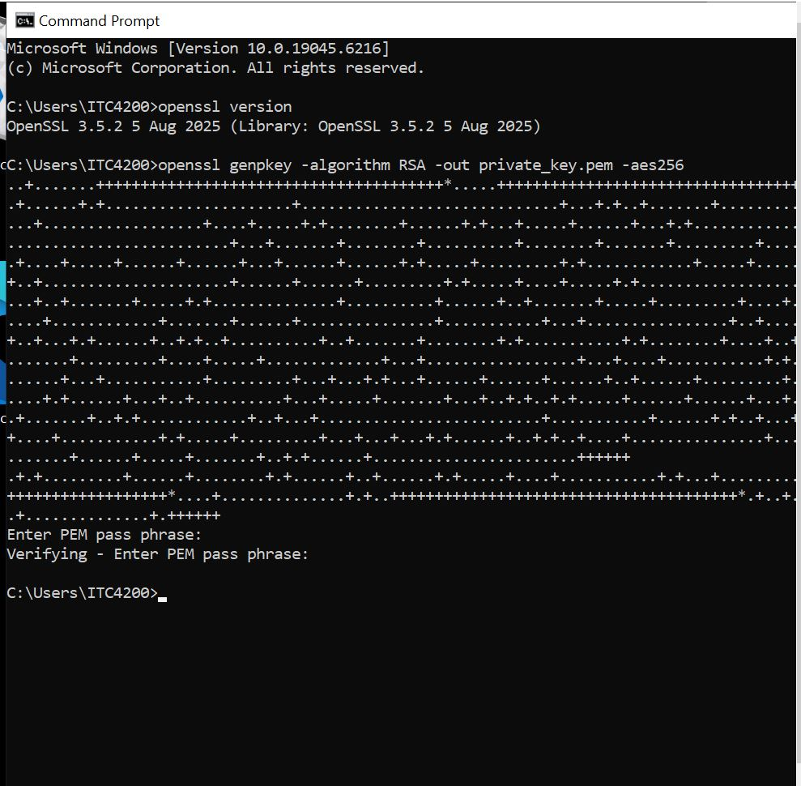
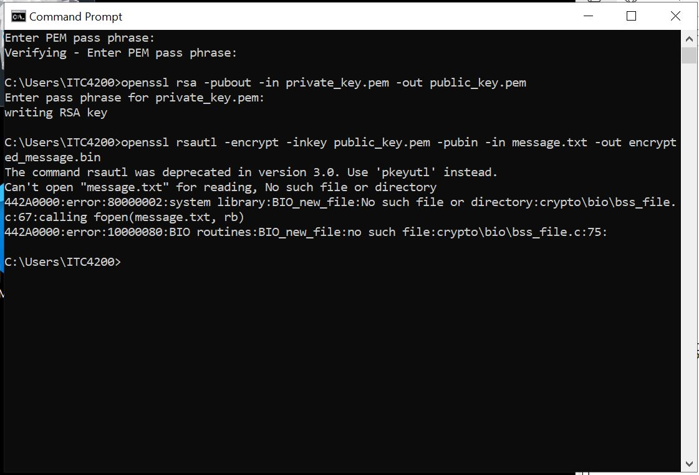
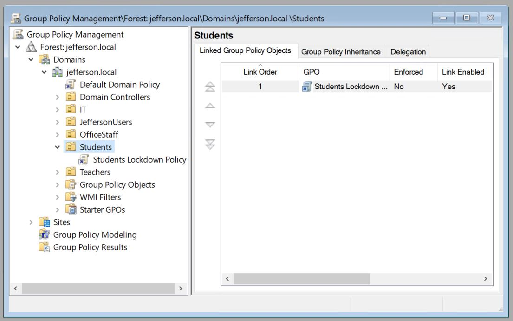

# Azure Active Directory Lab

## Project Overview

This lab demonstrates deployment and configuration of an Azure virtual machine, implementation of SSL/TLS encryption, HTTPS enforcement, OpenSSL key generation, and Active Directory Group Policy configuration.

The objective was to configure a secure web server inside an Azure-hosted Ubuntu virtual machine and apply directory-level security controls.

---

## 1. Azure Virtual Machine Deployment

### Ubuntu Virtual Machine Running in Azure

The Ubuntu virtual machine was successfully deployed in Microsoft Azure and accessed through Remote Desktop.

---

## 2. SSL Key Generation Using OpenSSL

### Private Key Generation

An RSA private key was generated using OpenSSL with AES-256 encryption.

### Public Key Extraction

The public key was extracted from the private key for encryption operations.

---

## 3. Apache SSL Configuration

### SSL Configuration File

Apache was configured to enable SSL by referencing the generated certificate and key files inside the default-ssl.conf configuration file.

---

## 4. HTTPS Enforcement and Validation

### HTTPS Functioning Properly

.JPG)

The website loads successfully over HTTPS, confirming SSL configuration is operational.

### HTTP Access Blocked After HTTPS Enforcement

.JPG)

HTTP access fails after enforcing HTTPS-only configuration, ensuring encrypted communication.

---

## 5. Remote Desktop Authentication Test

### Domain Credential Enforcement

.JPG)

Remote login attempt demonstrating credential authentication enforcement within the Azure lab environment.

---

## 6. Active Directory Group Policy Configuration

### Group Policy Linked to Students OU

The Students Lockdown Policy was successfully linked to the Students Organizational Unit within Active Directory.

---

## Security Concepts Demonstrated

- Azure Virtual Machine Deployment  
- SSL/TLS Encryption  
- Public and Private Key Cryptography  
- Apache Web Server Configuration  
- HTTPS Enforcement  
- Remote Authentication Controls  
- Active Directory Organizational Units  
- Group Policy Management  

---
